## Oslandia

Hugo Mercier

École Centrale Nantes, 28 novembre 2016

<!-- .slide: data-background="oslbackground.png" data-background-size="650px" -->

---

## Sommaire

* Oslandia
* Une entreprise open source
* Exemples de projets
* Architecture SIG
* SIG urbains
* Où en est on ?
* Futur

---

## Oslandia

* Création 2009
* 2 fondateurs
  * Olivier Courtin
  * Vincent Picavet
* 5 salariés en 2015
* 10 en 2016
* and counting ...

---

## Oslandia

* Orientation technique
  * C++, Python, web, ...
  * Graphes, Simulation, Data Science, ...

---

## Oslandia

<!-- .slide: data-background="image1.jpg" data-background-size="650px" data-state="outline" style="color:white"-->

Autour de la donnée SIG

* Acquisition
* Stockage
* Diffusion
* Traitement
* Analyse
* Visualisation

---

## Oslandia

Services en SIG open source

* Conseil / expertise
* Formation
* Développement
* Support

---

<!-- .slide: data-background="#fff" -->

## Technos <!-- .element: style="color:#000" -->

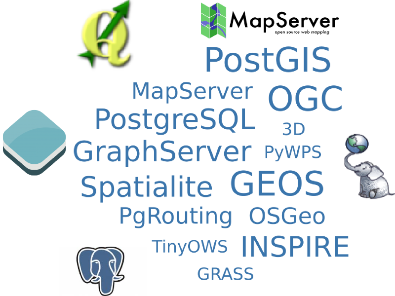

---

<!-- .slide: data-background="#fff" -->

## Technos <!-- .element: style="color:#000" -->

* Core developers : PostGIS, QGIS
* Membre OGC

---

## Modèle économique du libre

* libre / open source
  * librement copiables
  * code source consultable
  * et modifiable
* Copyleft

---

## Modèle économique du libre

* La copie des biens numériques a un cout qui tend vers 0
* Vendre des licences implique
  *  de limiter la diffusion du locigiel
  *  de créer des mesures anti-copie contre productives
  
* ** Autre approche ** <!-- .element: class="fragment" data-fragment-index="2" -->
* La valeur n'est plus dans la copie <!-- .element: class="fragment" data-fragment-index="3" -->

---

## Ecosystème du libre

* Vente de **services**
  * != éditeur ou "startup"
* Forte implication dans les projets open source
  * Pas seulement utilisateurs
* Expertise
* R&D
* Cercle vertueux
* *Release often, release soon*
* Etre compétent, le montrer et le rester
  * Conférences, hackfests, code sprints, community meetings

---

## Pour les décideurs

- indépendance vis à vis des prestataires
- libre != gratuit
- comparaison fonctionnalités libre vs. propriétaire difficile
  - quantité de travail payé généralement très différent
- cout = combien coûte une (non-)évolution logicielle
  - vs coût licences

---

## Exemples de projets

---

<!-- .slide: style="color:black" data-background-color="white" data-background="mappy_logo.png" data-background-size="600px" data-background-position="top"-->

## Mappy <!-- .element: style="color:black" -->

* Opérateur de PagesJaunes.fr
* Plusieurs milliards de requêtes par mois
* Accompagnement Oslandia:
  * Migration open source
  * Plateforme et culture

---

<!-- .slide: style="color:black" data-background-color="white" data-background="mappy_logo.png" data-background-size="600px" data-background-position="top"-->

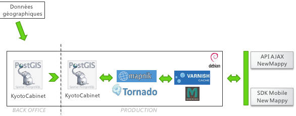

---

<!-- .slide: style="color:black" data-background-color="white" data-background="mappy_logo.png" data-background-size="600px" data-background-position="top"-->

Quelques chiffres :

* 14 serveurs (4 PostGIS)
* 2500 req/s
* 75 Go base PostGIS

---

<!-- .slide: style="color:black" data-background-color="white" data-background="mappy_logo.png" data-background-size="600px" data-background-position="top"-->

Gains :

* Temps de traitement réduits
* Standardisation des formats et API
* Diminution dette technique
* Baisse de coût
* Montée en compétence
* Maîtrise complète
* Mappy devient contributeur

---

## AEAG

Agence de l'Eau Adour Garonne

* Etablissement public
  * Recouvrement des redevances Loi sur l'eau (pollueur = payeur)
  * Redistribution sous forme d'aides
  * Surveillance milieux aquatiques
  * Production de données publiques

Accompagnement Oslandia

* Migration Mapinfo => QGIS + PostGIS

---

## AEAG

* Impasse : coûts licences MapInfo

* Solutions Open Source
  * QGIS, PostGIS, MapServer

* Démarche
  * Adapter les outils aux besoins

---

## AEAG - Oslandia

* Conseil en amont
* Formations
* Développements (QGIS)
  * Resolution de bugs
  * Nouvelles fonctionnalités (Atlas)
    * Légendes
    * Plugins (mask)

---

## Atlas

Plugin QGIS Python (1.8)

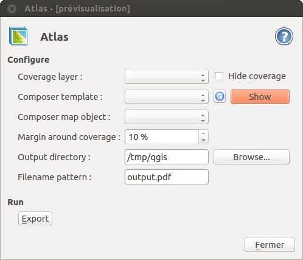

---

## Atlas

Intégration dans le coeur (2.0)

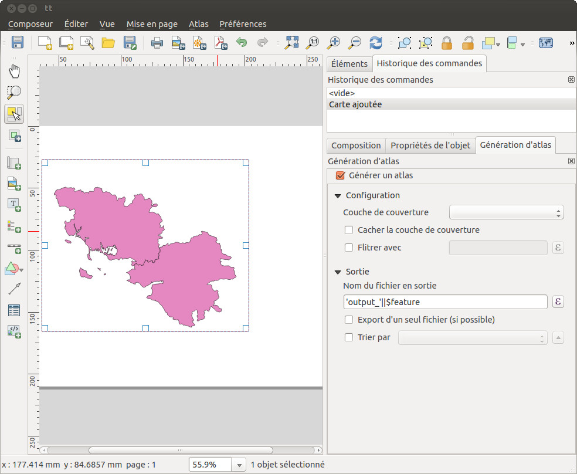

---

## Mask

* Intégration (partielle) d'un plugin
* Nouveau "renderer"

---

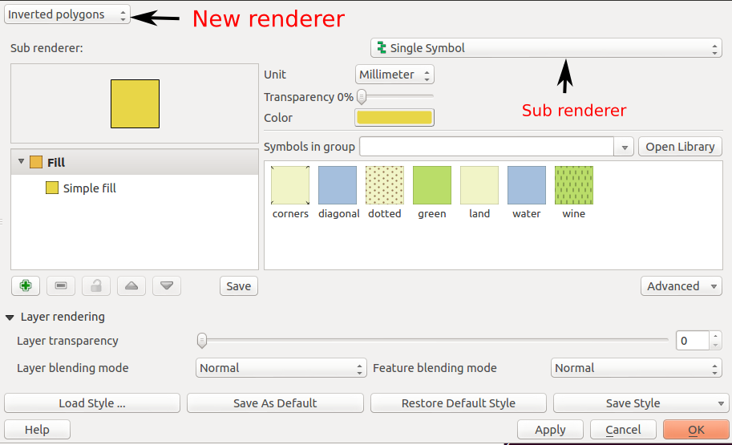

---

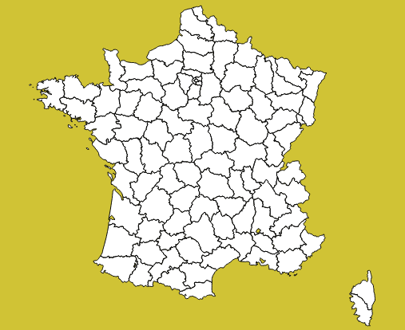

---

## Mask

* Peut être conjugé avec symbologie plus avancée

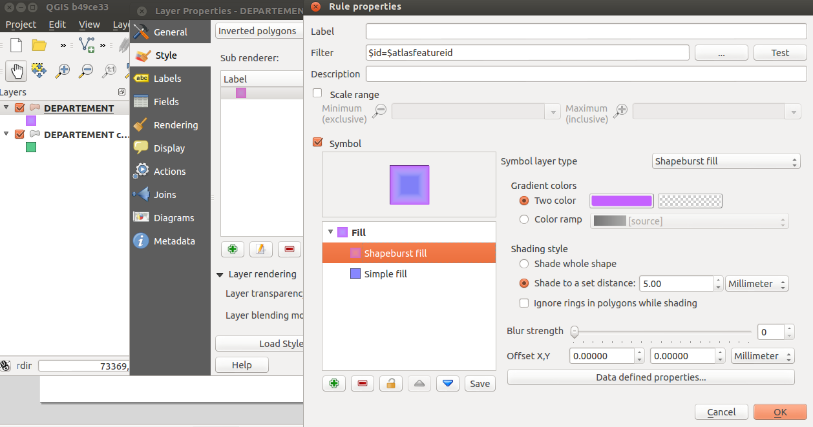

---

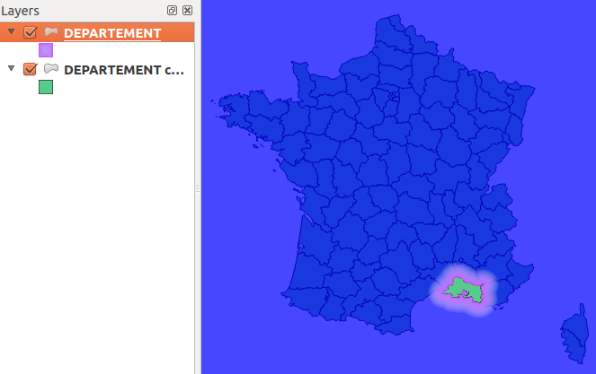

---

## Mask

https://vimeo.com/96600336

---

## MEDDE

Ministère de l'Ecologie, du Developpement Durable et de l'Energie

* Marché QGIS
* Collaboration avec Camp2Camp
* Recolte des besoins des services de l'état (local)
* Financement d'évolutions / corrections de bugs

---

## MEDDE

* Impact sur la gouvernance du projet QGIS
  * Comment "garantir" l'intégration d'un développement payé ?

* Ex: Couches virtuelles
  * Utiliser la puissance du SQL pour tous les types de couches

https://vimeo.com/123287076

https://vimeo.com/123287075

---

## MEDDE / AEAG - Suite

* Démarche communautaire
* Besoins avancés sur l'étiquetage, intégration coeur
* QEP - QGIS Enhancement Proposal
  * Premier financement AEAG pour écrire des QEP
  * Ex: mask : https://github.com/qgis/QGIS-Enhancement-Proposals/issues/49
* Permet d'avancer plus sereinement
* + financement de la première partie sur 2017

---

<!-- .slide: data-background="tempus.jpg" data-background-color="white" data-background-position="top" style="color:black" data-background-size="900px"-->

## Tempus <!-- .element: style="color:black" -->

* Collaboration labos de recherche IFSTTAR / CEREMA

* Plateforme pour la recherche d'itinéraires multimodaux
  * développement de nouveaux algorithmes
  * mise en production d'algorithmes existants

---

<!-- .slide: data-background="tempus.jpg" data-background-color="white" data-background-position="top" style="color:black" data-background-size="900px"-->

## Tempus - Oslandia <!-- .element: style="color:black" -->

* Industrialisation de code
* Architecture Open source
  * Outils et standards

* Démarche d'ouverture de code

---

<!-- .slide: data-background="tempus.jpg" data-background-color="white" data-background-position="top" style="color:black" data-background-size="900px"-->

## Tempus <!-- .element: style="color:black" -->

---

<!-- .slide: data-background="tempus.jpg" data-background-color="white" data-background-position="top" style="color:black" data-background-size="900px"-->

Video

https://vimeo.com/114875069

---

<!-- .slide: data-background="tempus.jpg" data-background-color="white" data-background-position="top" style="color:black" data-background-size="900px"-->

Client Android - Congrés ITS 2015 - Bordeaux

---

<!-- .slide: data-background="tempus.jpg" data-background-color="white" data-background-position="top" style="color:black" data-background-size="900px"-->

## Tempus

Partenariats

* Mappy
  * Nouveaux algorithmes (CH)

Suite

* Nouveau marché 2017
  * API Python / SQL
  * client web + performances

---

## Les SIG

Focus sur données géolocalisées

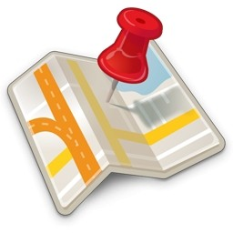

* Capturer / Créer
* Stocker
* Analyser
* Partager
* Visualiser

---

<!-- .slide: data-background="raster_vector.png" data-background-size="650px" -->

---

## Architecture SIG <!-- .element: style="color:black" -->

<!-- .slide: data-background="archi_sig.png" data-background-size="800px" -->

---

## OGC

Open Geospatial Consortium

* WFS
* WMS
* WCS
* WPS
* Simple Features (ISO SQL/MM)
* CityGML

But :

* Les utiliser et les développer
* Renforcer l'interopérabilité

---

## Stocker la donnée

BDD spatiale PostGIS

* Extension PostgreSQL
* Justification
  * Grande quantité de données
  * Centralisation
  * Système d'information
* Traitements SQL
  * Abstraction mémoire
* Spatialite <!-- .element: class="fragment" data-fragment-index="2" -->
  * Applications embarquées <!-- .element: class="fragment" data-fragment-index="2" -->

---

## Servir la donnée

WebServices standardisés (WFS, WMS) :

* Mapserver
* TinyOWS
* MapCache
* (QGIS server)

---

## Visualiser la donnée

* Clients lourds
  * QGIS
* Clients web
  * Leaflet, OpenLayers

---

## PostGIS - QGIS <!-- .element: style="color:black" -->

<!-- .slide: data-background="postgis_within_qgis.jpg" data-background-size="80%" -->

Note:
PostGIS comme outil de traitement
QGIS comme outil de visualisation

---

## Plugins QGIS

* Python
* Permet de tester des concepts
  * Pour intégration futur dans le coeur
* De faire du spécifique

---

## SIG urbains

* Croisement de données hétérogènes
* Volume (Big Data)
* Smart cities

* Enjeux :

  * Représentation
  * Visualisation

---

## Approche R&D

Travaux alimentés par notre axe R&D :

* Projet ePLU
* 3D :
 * Traitement
 * Visualisation
 * (Représentation)

---

## e-PLU

* Objectif : PLU électronique
* IGN, QuelleVille?, Oslandia

---

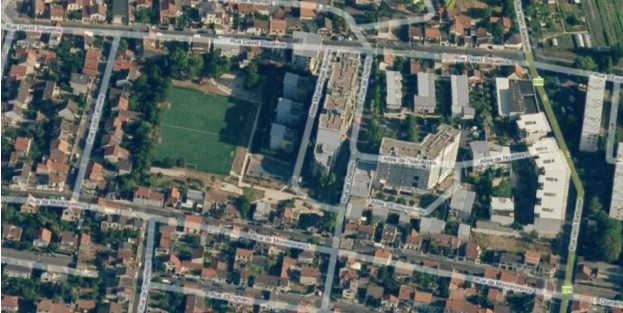

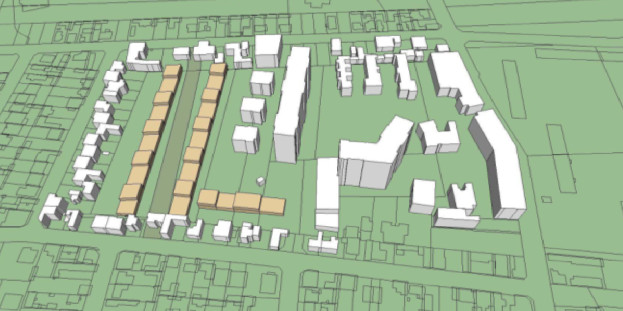

---

## Données 3D

Besoin de croiser des données 3D

=> Besoin d'opérateurs 3D

---

## Construction 3D

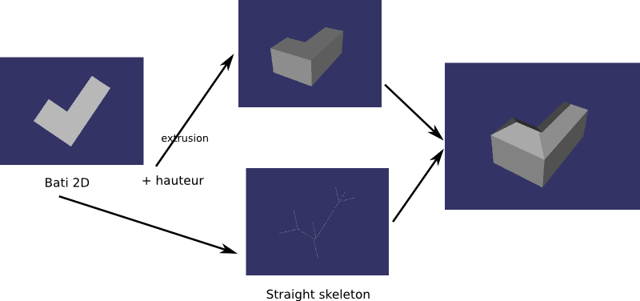 <!-- .element style="border:0px" -->

---

## Analyse spatiale 3D

* Bibliothèque SFCGAL
  * **S**imple **F**eatures CGAL
  * CGAL: bibliothèque géométrique 2D/3D
* Intégration dans PostGIS

---

## PostGIS 3D

* ST_3DIntersection, ST_3DUnion, ST_3DDifference
* ST_Tesselate
* ST_Extrude
* ST_MinkowskiSum
* ST_StraightSkeleton
* ST_ConvexHull

https://vimeo.com/74869530

---

## Point cloud

* Généralement issu d'acquisition LIDAR
* Enormément de données !

* Intégration encore rudimentaires

(video)

---

## Représentation

* Volume
  * Performances + intelligibilité
  * => Multi-échelle
  * Données à découper en LOD
  * Visualisation intelligente

---

## LOD

* LOD dans CityGML

* Le niveau de détails dépend de l'application
  * Performances vs. Symbologie
  * => vers une automatisation (simplification)

---

## Symbologie 3D

* 2D formes plates dans l'espace ?
* 2D 1/2 - composante Z
  * Données Vector
  * Données Raster (MNT)
* 3D - Nouvelles formes
  * Extrusion
  * Marqueurs 3D
  * Règles procédurales
  * Etiquetage ?

---

## Visualisation

* Orientation web / dataviz
* WebGL
  * Utilisation du processeur graphique
* Suite logicielle 3D

---

## Stack 3D

* PostGIS 3D + webservices + clients 3D
* Client pour QGIS : Horao
* Client web : iTowns

---

## Stack 3D

Horao

https://vimeo.com/74869530

iTowns

* Open Source depuis fin 2015

---

## iTowns

* framework Javascript/WebGL opensource
* données géospatiales
* visualisation 3D
* environnement immersif
* "Mobile mapping"
* ~ "Google Earth / Street View libre avec vos propres données"

---

## iTowns

* Projet IGN depuis 2008
* v1.0 Open source via collaboration Oslandia + AtolCD 2016
* 2017: vers un v2.0

---

## iTowns à l'IGN

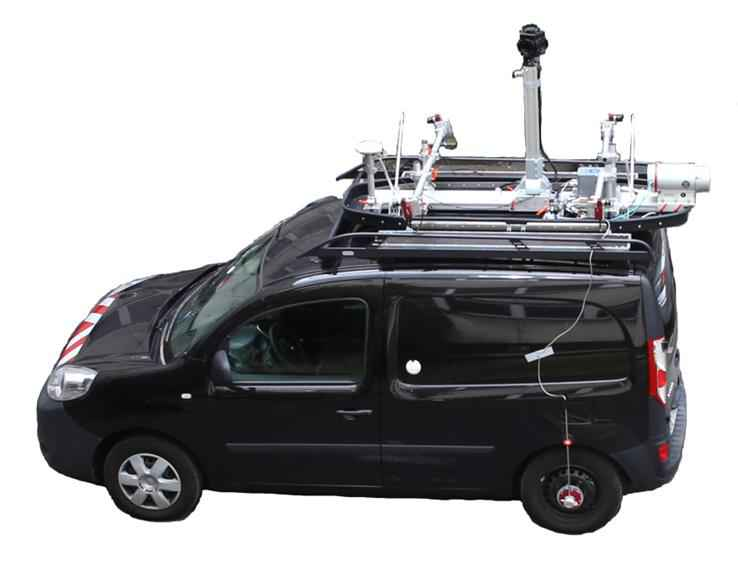

---

## iTowns à l'IGN

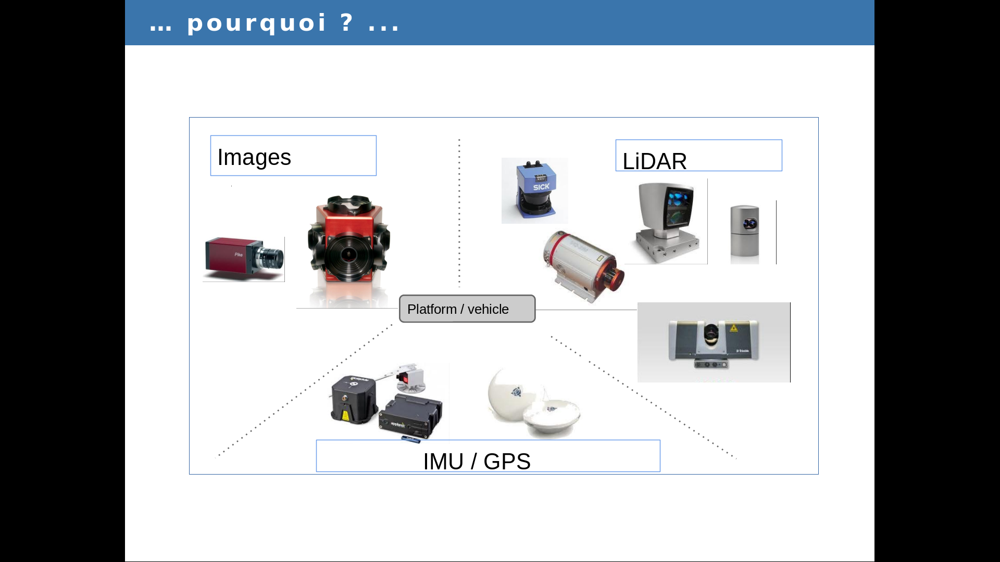

---

## iTowns

https://vimeo.com/192910346

---

## iTowns

* Oslandia - focus sur Point Cloud
* Point cloud dans PostGIS
* projet "LoPoCS"

https://vimeo.com/189285883

---

## Futur

* Intégration données temporelles
  * Données + interface graphique
* Symbologie 3D
* Performances ET respect des standards (streaming 3D)
  * glTF
  * Cesium 3D Tiles

---

## Questions ?

